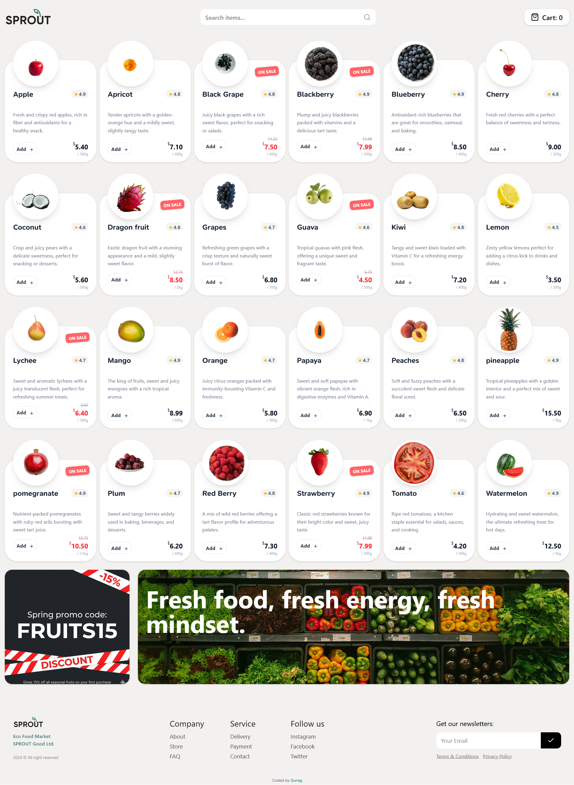
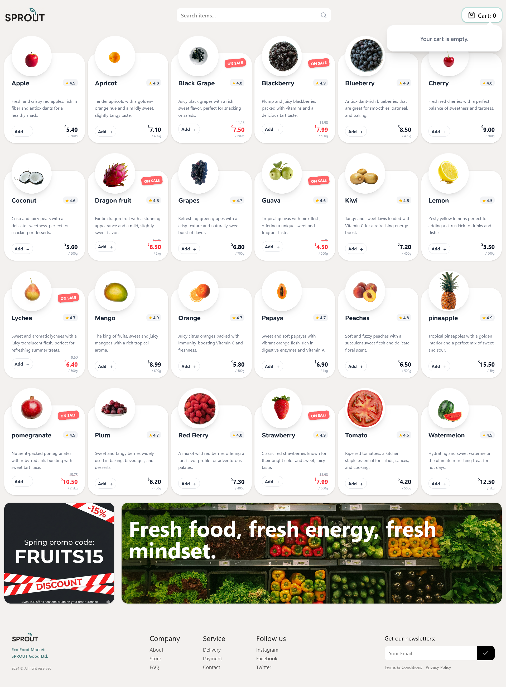
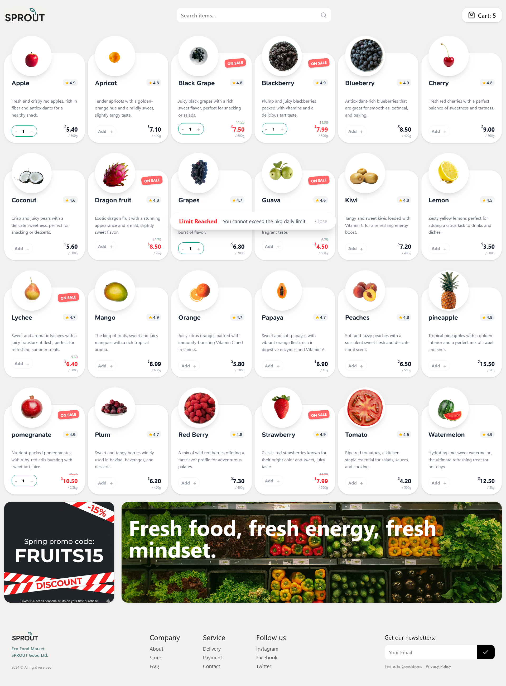
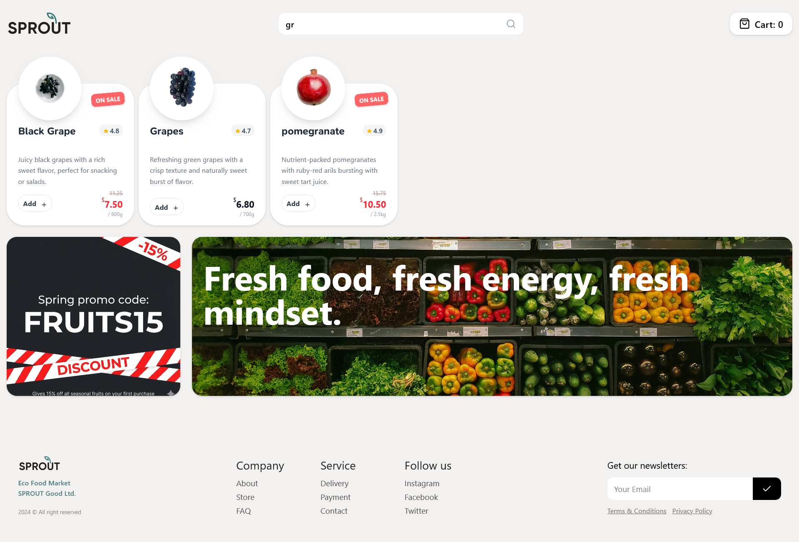
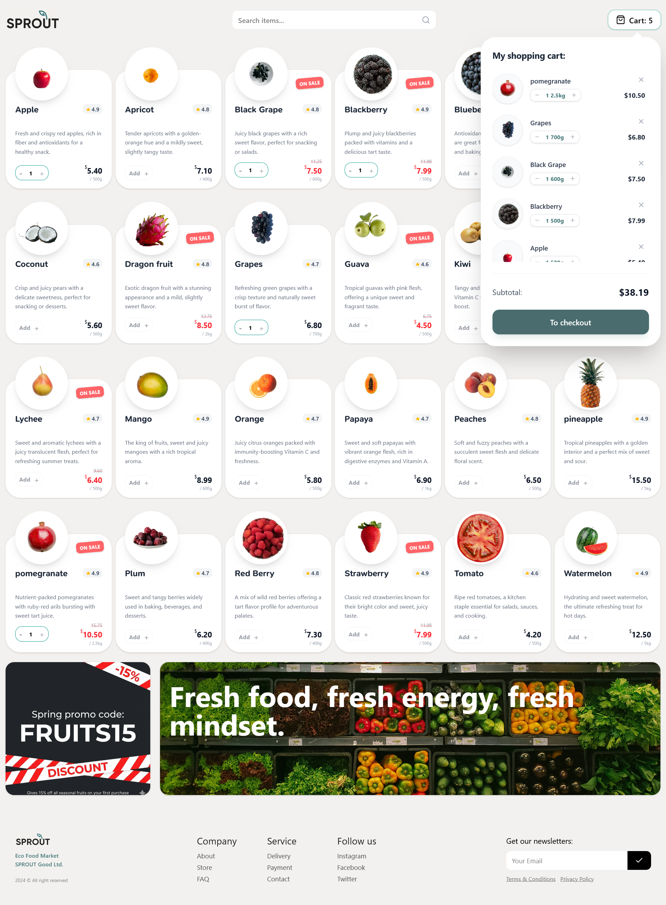
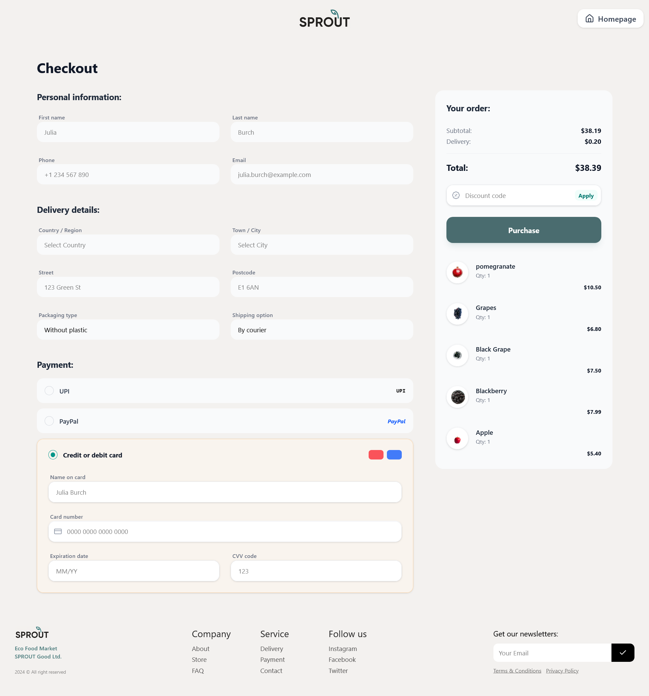
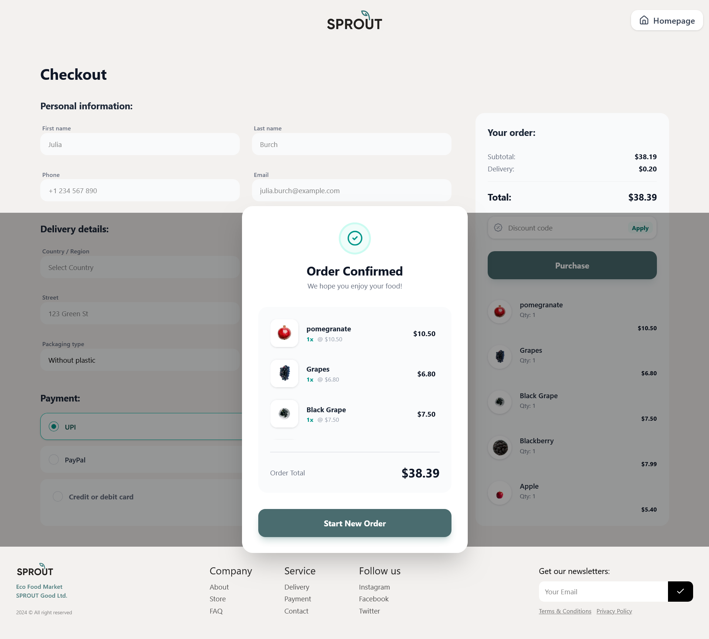
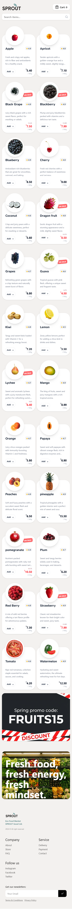
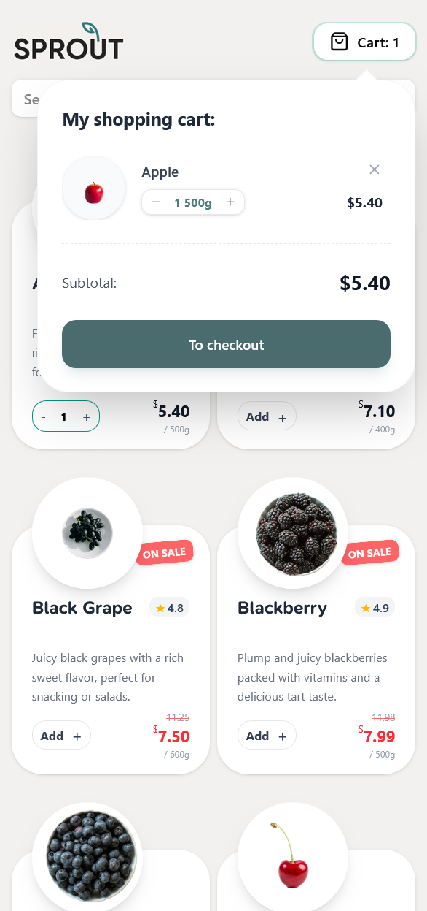

# React + TypeScript + Vite

# 🌱 Sprout - Organic Grocery & Eco-Friendly Market

## Table of contents

- [Overview](#overview)
  - [Features](#Features)
  - [Screenshot](#screenshot)
  - [Demo Link](#link)
  - [Built with](#built-with)
  - [Future Enhancements](#FutureEnhancements)
  - [Installation & Setup](#Installation&Setup)
  - [🤝 Contributing](#Contributing)
  - [Author](#author)

## Overview

A modern and responsive e-commerce web application built with React, TypeScript, Redux, and Tailwind CSS.Sprout-ecom provides a smooth shopping experience with product search, cart management, and order confirmation.

### ✨ Features

- 🔍 Product search functionality

- 🛒 Add to cart

- 📦 Cart preview before purchase

- ✅ Order confirmation after purchase

- 📱 Fully responsive design

- ⚡ Fast and optimized UI

### Screenshot

### Screenshot(Mobile)

### Demo Link

- URL: (https://sprout-ecom.vercel.app/)

### 🛠️ Tech Stack

- ⚛️ React JS – Component-based UI development

- 🟦 TypeScript – Type safety and better developer experience

- 🎨 Tailwind CSS – Utility-first styling

- 🔄 Redux – Global state management

- 🧭 React Router DOM – Client-side routing

- 📝 React Hook Form – Form handling & validation

- ▲ Vercel – Deployment and hosting

## 📌 Future Enhancements

I plan to continue improving this project by adding:

🛍️ More products

🎯 Product filtering functionality

🗂️ Category-based browsing

🔐 User authentication (Login & Signup)

👤 User profile dashboard

📦 Order history tracking

💳 Payment gateway integration

## 📂 Installation & Setup

- git clone https://github.com/911Sunag/Sprout-ecom.git
- cd Sprout-ecom
- npm install
- npm run build

## 🤝 Contributing

Contributions, suggestions, and feedback are always welcome!
Feel free to fork the repository and submit a pull request.

## Author

- @Sunag Arigala
